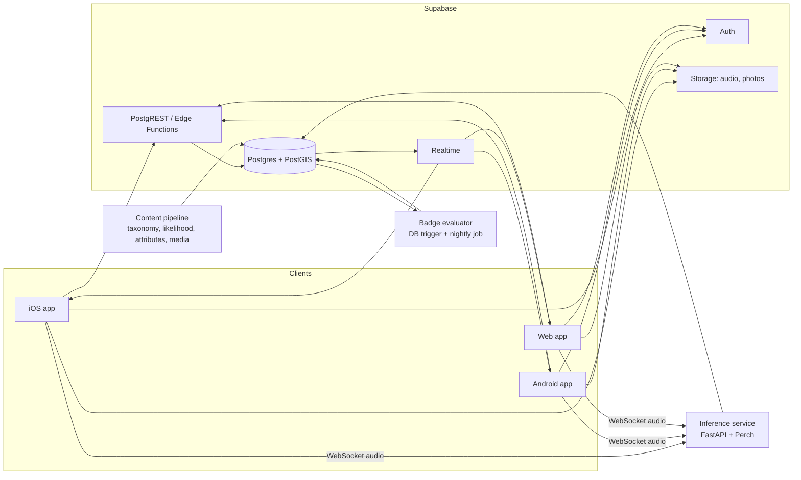

# Social Bird Watching App — Design Document

**Status:** Draft v0.3 (2026-09-03)
**Name:** Fluttr (working title)
**Platforms:** iOS, Android, Web

---

## 1. Overview

A cross-platform bird watching app that combines the two best identification tools from Merlin Bird ID (live **Sound ID** and a **question-based ID wizard**) with a collecting loop borrowed from games: once a bird is identified, the user **catches** it. Catches build a life list, unlock **badges**, and are shared with **friends**, who can congratulate each other.

The pitch in one line: *Merlin's identification, Pokémon's collecting, Strava's social loop.*

### Decisions log

**2026-09-03**
- Name: Fluttr (working title). "Flutter" was considered and dropped because Google holds a software trademark on the Flutter framework.
- Offline-first is a must-have. On-device Sound ID and offline catching are core to v1, not roadmap items, because most birding happens without service.
- Keep the sound model (Perch) and the likelihood data source (GBIF now, eBird as an alternative) behind interfaces so each can be swapped.
- Monetization is deferred. The licensing choices in §5 keep it open without deciding it.
- Web is a secondary platform for Sound ID.
- North America only at launch. Later, users choose which regions to download.
- React Native + Expo over Flutter.
- Wizard attribute accuracy: ship a working version first, improve the data once the app is playable.

**2026-09-03 (later)**
- Downloads are chosen by the user before heading out: a small required core pack, plus optional photo and sound packs per region, so people with little space can skip images.
- New feature: **play bird sounds** (songs and calls) per species, offline from the sound pack, with an ethics reminder. Mirrors Merlin's playback.
- Species descriptions and photos come from Wikipedia and Wikimedia Commons. For now the app stores image URLs and caches on view; images move into the photo pack when packs are built.

### Goals

1. Identify birds by sound in near real time, and by a short series of questions.
2. Make logging a bird ("catching") a one-tap, satisfying moment.
3. Reward progress with a badge system that is data-driven and extensible without app releases.
4. Let users add friends, browse their catches, and send congratulations.
5. Ship one codebase across iOS, Android, and web.

### Non-goals (v1)

- Photo-based identification (roadmap item).
- Full eBird-style checklists, effort tracking, or scientific data submission.
- Trading, battling, or any competitive mechanic beyond badges and optional friend comparisons.
- Global species coverage on day one. v1 targets North America, with the data model built for global expansion.

---

## 2. Target Users

- **Casual naturalists** who liked Merlin but want a reason to keep going.
- **Beginner birders** who want structure and encouragement.
- **Friend groups and families** who bird together or in different places and want to compare.

Not the primary target: serious listers who already live in eBird. We should still make it easy for them to export.

---

## 3. Core User Flows

### 3.1 Sound ID → Catch

1. User taps **Listen**. Mic permission requested on first use.
2. A scrolling spectrogram plays while audio is captured in 3-second windows.
3. As species are detected, they appear in a list below the spectrogram with a confidence indicator and a live "heard now" pulse.
4. User taps a species → detail sheet (photo, range note, sound comparison) → **Catch**.
5. Catch is saved with the audio clip that triggered it (optional to keep), location, and time.
6. Any badges earned appear in a celebration overlay. Friends are notified per the user's sharing settings.

### 3.2 Question ID → Catch

1. User taps **Identify by questions**.
2. Wizard asks, in order: **Where** (auto from GPS, editable), **When** (default now), **Size** (sparrow / robin / crow / goose sized, with silhouettes), **Main colors** (pick up to 3), **What was it doing** (feeder, ground, trees/bushes, fence/wire, swimming/wading, soaring).
3. App shows a ranked list of likely species, filtered by attributes and ordered by regional/seasonal likelihood.
4. User taps a candidate → detail sheet → **Catch**.
5. Same celebration and sharing as above.

### 3.3 Manual Catch

For birds the user already knows: search by name → detail → Catch. Always available so the app never blocks a log.

### 3.4 Life List & Profile

- Life list with filters (family, region, year, method of ID).
- Profile shows species count, badge showcase, recent catches, streak.

### 3.5 Play sounds

1. On a species page, tap a recording (song, call, etc.). It plays from the downloaded sound pack; if the pack is missing, the app streams it when online and offers the pack download.
2. A short, dismissable reminder appears the first time playback is used: keep it brief, do not use playback near nesting birds, and follow local rules. Playback is disabled for species on the sensitive list.
3. Recording credit (recordist, source, license) shows under the player.

### 3.6 Download packs

1. From Settings or a first-run prompt, the user picks a region and which components to download: **Core** (species, descriptions, likelihood, wizard attributes; small, required), **Photos**, and **Sounds**. Each shows its size.
2. Packs download in the background and can be deleted individually. The app works fully offline with whatever is installed; anything missing degrades gracefully (a placeholder photo, a "download sounds" button).

### 3.7 Friends

- Add by username, QR code, or contacts (with explicit consent).
- Friend request → accept model (mutual). No public follow in v1.
- Friend feed: recent catches and badges earned. Tap **Congratulate** (a single reaction) or leave a short comment.
- Friend profile: their life list and badges; a "birds they have that you don't" comparison view.

---

## 4. Feature Design

### 4.1 Sound ID

**Approach for v1: on-device inference on mobile, server-side for web.** The mobile app runs the classifier locally through a native module (TFLite or ExecuTorch), so Sound ID works with no signal. A Python inference service runs the same model for web and as a fallback. Rationale:

- Most birding happens where there is no service. Offline Sound ID is a must-have.
- The classifier sits behind one `SoundClassifier` interface with `LocalClassifier` (mobile) and `RemoteClassifier` (web, fallback) implementations, so the model can be swapped or upgraded without touching the UI.
- Web is a secondary platform for Sound ID, and the server path is enough there.

**Model choice:** Google **Perch** (Apache 2.0; ~10k+ species, trained on Xeno-canto data). BirdNET is more widely known but its models are **CC BY-NC-SA 4.0**, which prohibits commercial use without a separate license. Monetization is deferred, so Perch is the safe default. Decision: build on Perch, keep the classifier behind an interface so BirdNET can be swapped in for evaluation or a non-commercial build. Perch was designed for server inference, so converting it to a mobile runtime and measuring on-device latency is the first Sound ID task.

**Pipeline:**

1. Client captures mono audio at the model's expected sample rate (Perch: 32 kHz; resample on device if needed).
2. Audio is chunked into 3-second (or 5-second for Perch) windows with 50% overlap to avoid cutting calls. On mobile the window goes straight to the local model; on web it is sent over a WebSocket to the inference service.
3. The classifier runs the model, gets per-species logits, then applies a **location/season prior**: species unlikely in that region and month are down-weighted or removed. This prior is the single biggest driver of perceived accuracy.
4. Results returned as a list of `(species, confidence, window_start, window_end)`. Client aggregates over the session so a species that fires in 3 windows shows higher confidence than one that fired once.
5. Detected windows are kept in a client-side ring buffer so the user can replay what triggered the detection and attach it to the catch.

**Region packs.** The on-device model needs the species list, likelihood table, attributes, and images for the user's area. These ship as downloadable region packs. v1 bundles North America; later, users pick which regions to download.

**UX details borrowed from Merlin worth keeping:**
- Live spectrogram is not decoration; it teaches users to see calls.
- Species rows light up when heard *right now*, not just "heard this session."
- A confidence threshold that is conservative by default with a "show more" affordance.

### 4.2 Question-Based ID

**Inputs:** location, date, size class, up to 3 colors, behavior.

**Data needed per species:**
- Size class (1 of 4; some species span two).
- Color tags (a fixed vocabulary of ~12 colors; each species has primary colors plus "male/female/juvenile" variants where they differ).
- Behavior tags (feeder, ground, trees, wire, water, soaring).
- Regional likelihood by month.

**Ranking:** hard-filter on size and behavior (with tolerance for adjacent size classes), soft-score on colors (fraction of user-picked colors present in the species' tags), multiply by regional likelihood for that month. Show the top 15 with "show more."

**Attribute source:** No fully open dataset exists with exactly these tags. Plan: seed ~600 North American species with attributes generated from field-guide descriptions and Wikipedia text (LLM-assisted), stored as versioned JSON so corrections ship as content updates. Ship a first version and improve accuracy once the app is playable.

### 4.3 Catching & Life List

A **catch** is the atomic record:

- species, timestamp, location (precise, stored privately), ID method (`sound`, `wizard`, `manual`), confidence (if sound), optional audio clip, optional photo, optional note.
- A user can catch the same species many times; the **life list** is the distinct set. The first catch of a species is a "lifer" and gets extra celebration.
- Catches can be edited or deleted; badges are re-evaluated on delete (badges are only revoked if the underlying rule no longer holds and the badge is marked `revocable`).

Terminology: "catch" is playful and shows up in UI copy, but records are called `sightings` in the schema so we don't back ourselves into a cutesy data model.

### 4.4 Badges

**Principle: badges are data, not code.** Each badge is a definition row with a rule expressed in a small JSON rule language evaluated on the server after every sighting is written (and on a nightly job for time-based badges). New badges can be added without an app release; the client renders from the definition (name, description, icon asset, tier).

**Categories for launch:**

| Category | Examples |
|---|---|
| Milestones | First catch; 10 / 25 / 50 / 100 / 250 species |
| Method | First Sound ID catch; first Question ID catch; 25 sound catches |
| Family / group | 5 warblers; 5 woodpeckers; all 3 local nuthatches; 10 raptors |
| Time | Dawn Chorus (catch before 6 a.m.); Night Owl (an owl after 9 p.m.); 7-day streak; 30-day streak |
| Season | Spring Migrant (10 species in April–May); Winter Visitor |
| Place | Species in 3 states/provinces; 5 countries; Home Patch (25 species within 1 km of home) |
| Rarity | A species with regional likelihood under 1% for that month |
| Social | First friend; 10 congratulations sent; a friend caught a bird you don't have |

**Rule language (sketch):**

```json
{
  "id": "warbler-5",
  "name": "Warbler Watcher",
  "tier": "bronze",
  "rule": { "type": "distinct_species_count", "filter": { "family": "Parulidae" }, "gte": 5 }
}
```

Rule types for v1: `distinct_species_count`, `sighting_count`, `streak_days`, `time_of_day`, `region_count`, `rarity_below`, `friend_count`, `reactions_sent`. Each maps to one SQL query. Tiers (bronze/silver/gold) are just multiple definitions sharing a `series` key so the UI can show progression.

**Anti-cheat:** the system is honor-based like most birding. Mitigations: badges for rare birds require an attached audio clip or photo; obviously impossible catches (species far outside range, 100 species in one minute) are flagged for soft review rather than blocked.

### 4.5 Bird sounds playback

Each species has a set of reference recordings tagged by type (song, call, alarm, flight call, juvenile). The species page lists them with a waveform-free, one-tap player; one plays at a time.

- **Source:** Xeno-canto, filtered to good-quality (A/B) recordings, a handful per species, trimmed to about 20 seconds and normalized. Fetched by a build script with the Xeno-canto API (v3 requires a free key) and stored with recordist and license.
- **Relationship to Sound ID:** none at runtime. The Perch model ships pre-trained; playback recordings are only for people to listen to. Later they double as an evaluation set for the classifier.
- **Ethics:** ABA and eBird guidance discourages playback near nesting birds, for rare or sensitive species, and where it is prohibited. The app shows a one-time reminder, disables playback for sensitive-list species, and never auto-repeats a recording.
- **Licensing:** most Xeno-canto recordings are CC BY-NC-SA or CC BY-NC-ND. Fine for a free app with attribution; revisit if monetizing (see §5).

### 4.6 Friends & Social

- **Friendship** is mutual: request → accept. Block and remove supported.
- **Feed** is friends-only, reverse chronological, showing catches and badges. No algorithmic ranking in v1.
- **Reactions:** one reaction type at launch ("Congrats!"), stored per (user, feed item). Comments are short text, editable, deletable, reportable.
- **Notifications:** push (mobile) and in-app (all platforms) for friend requests, reactions, comments, and "lifer" catches by friends. All configurable.
- **Privacy defaults:** catches are shared with friends by default with **coarse location** (nearest ~10 km grid cell or named region), never precise coordinates. Users can set per-catch visibility (friends / private). Home location is never shown.
- **Sensitive species:** maintain a list of species whose locations should not be shared (nesting raptors, owls at roost, rare breeders). Catches of these show *no* location to friends regardless of settings. This mirrors eBird's sensitive-species policy and matters ethically.

---

## 5. Data & Content Sources

| Need | Source | License / Note |
|---|---|---|
| Taxonomy | eBird/Clements checklist (annual CSV) | Free download; attribution required. Use eBird 6-letter codes as species keys for interoperability. |
| Sound model | Google Perch | Apache 2.0. Safe for commercial use. |
| Sound model (alt) | BirdNET | CC BY-NC-SA 4.0. Non-commercial only; do not ship in a paid/ad-supported build without a license. |
| Regional likelihood | GBIF occurrence data (includes a large eBird export), aggregated to region × month | Open licenses (CC0/CC BY per dataset); verify per dataset. Precompute offline into our own table; never call GBIF at runtime. |
| Regional likelihood (alt) | eBird API 2.0 | Free for non-commercial; **commercial use requires written permission from Cornell**. Do not build the core product on it unless we secure that. |
| Descriptions | Wikipedia page summaries (via the REST summary API) | CC BY-SA 4.0. Show a "From Wikipedia" credit with a link. |
| Photos | Wikimedia Commons lead image from each species' Wikipedia page (v1); iNaturalist CC photos later | Author and license fetched per image from Commons and stored; credit shown under the photo. Quality is uneven; curate later. |
| Reference sounds | Xeno-canto (API v3, free key) | Mostly CC BY-NC-SA / BY-NC-ND. Playback with attribution inside the app, distributed only inside our sound packs. Revisit if monetizing. |
| Species attributes (size/color/behavior) | Our own curated dataset | See §4.2. This is a build-it-ourselves item. |

Licensing takeaway: **stay off the eBird API and BirdNET for core paths** so monetization stays an open option, and keep both the classifier and the likelihood data source behind interfaces so switching (for example to eBird data) is a configuration change. Every media asset carries an attribution string in the database.

---

## 6. Architecture

### 6.1 Tech stack

| Layer | Choice | Rationale |
|---|---|---|
| Client | **React Native + Expo** (Expo Router, react-native-web) | One codebase for iOS/Android/web; mature audio, camera, location, and push APIs; web output is a real PWA. |
| Alternative | Flutter | Equally capable; chosen against mainly for the web audio/WebSocket ecosystem and hiring pool. Either is fine. |
| Backend platform | **Supabase** (Postgres + PostGIS, Auth, Storage, Realtime, Edge Functions) | Fast to stand up for a small team; Postgres gives us real geo queries and the badge rule engine is just SQL. |
| Inference service | **Python / FastAPI** running Perch, deployed as a container (GPU optional; CPU works for a few concurrent streams) | Serves web and acts as fallback. ML tooling is Python. Kept separate so it scales independently and can be swapped. |
| Auth | Supabase Auth with Apple, Google, and email | Apple requires Sign in with Apple when other social logins are offered on iOS. |
| Push | Expo Push (wrapping APNs/FCM) | Simplest cross-platform path. |
| Analytics / errors | PostHog + Sentry | Both have RN and web SDKs. |

### 6.2 System diagram



### 6.3 Key flows through the system

- **Sound ID (mobile):** audio windows go to the local classifier; the likelihood prior comes from the downloaded region pack. Nothing leaves the device until the user catches and syncs.
- **Sound ID (web):** the client opens a WebSocket to the inference service with the user's JWT and streams PCM windows; the service classifies and applies the same prior.
- **Catch:** client POSTs a sighting; a DB trigger enqueues badge evaluation; the evaluator writes any new `user_badges` rows; Realtime pushes the result back so the celebration appears within a second.
- **Feed:** a `feed_items` table is written on catch/badge events (fan-out on write), filtered by friendship on read. At v1 scale this is simpler than fan-out on read and easy to query.

### 6.4 Offline behavior and download packs

- Offline-first. Every core flow (Sound ID, wizard, manual catch, life list, sound playback) works with no connection. The local database is the source of truth on device; the server is a sync target.
- Catches, edits, and deletes queue locally and sync when online. Badge evaluation runs on the server after sync, with a local pre-check so the celebration can still show offline for simple rules.
- **Packs** are per region and per component, chosen by the user:

  | Component | Contents | Rough size (North America) |
  |---|---|---|
  | Core (required) | species list, descriptions, likelihood by month, wizard attributes, sensitive list | a few MB |
  | Photos | one to three photos per species at phone resolution | 100–300 MB |
  | Sounds | three to six trimmed recordings per species | 300–600 MB |
  | Sound ID model | Perch converted for mobile | 50–150 MB |

- A pack is a versioned zip with a manifest; the app downloads it to app storage, verifies a checksum, and records it in `installed_packs`. Updates are deltas by version. Packs are hosted as static files (object storage behind a CDN), no server code needed.
- The current build predates packs: descriptions ship inside the app, and photos are URLs cached on first view. The screens read from the same tables either way, so moving to packs does not touch the UI.

## 7. Data Model

Core tables (Postgres). Row Level Security enforces that users only read friends' shareable data.

- **users** — id, username, display_name, avatar_url, home_region (coarse), created_at
- **species** — id (eBird code), common_name, scientific_name, family, order, taxonomy_version
- **species_attributes** — species_id, size_class[], colors[], behaviors[], variant (default/male/female/juvenile)
- **species_likelihood** — species_id, region_id, month, frequency (0–1)
- **regions** — id, name, level (country/state/grid cell), geometry
- **species_media** — species_id, kind (photo/audio), subtype (song/call/…), url or pack path, duration, attribution (author, source, license, license_url, page_url), quality
- **installed_packs** — region_id, component (core/photos/sounds/model), version, size_bytes, installed_at
- **sightings** — id, user_id, species_id, observed_at, location (geography, private), coarse_region_id, method, confidence, audio_url, photo_url, note, visibility
- **badge_definitions** — id, series, tier, name, description, icon, rule (jsonb), revocable, active
- **user_badges** — user_id, badge_id, earned_at, sighting_id (which catch triggered it)
- **friendships** — requester_id, addressee_id, status (pending/accepted/blocked), created_at
- **feed_items** — id, actor_id, kind (catch/badge), ref_id, created_at
- **reactions** — user_id, feed_item_id, kind
- **comments** — id, user_id, feed_item_id, body, created_at
- **notifications** — user_id, kind, payload, read_at
- **sensitive_species** — species_id, region_id (nullable = global), reason

---

## 8. Privacy, Safety & Ethics

- Precise coordinates are never exposed to other users; only the user's own device and the server see them.
- Sensitive species hide location entirely in social contexts.
- Location permission is "while using" only; no background tracking.
- Audio recordings are kept only if the user chooses to attach them to a catch; streaming audio for classification is discarded after inference.
- Minimum age 13 (COPPA); no public profiles or discoverability beyond friends in v1.
- Reporting and blocking on all user-generated content from day one.

---

## 9. Phased Roadmap

**Phase 0 — Content foundation (parallel with Phase 1)**
Taxonomy import, regional likelihood table for North America from GBIF, first pass of species attributes for ~600 species, licensed photo set with attribution.

**Phase 1 — Catch & list (MVP core)**
Auth, species browser, manual catch, wizard ID, life list, profile. Offline queue. This is a usable app on its own.

**Phase 1b — Species pages and packs**
Descriptions and photos on species pages (done, via Wikipedia URLs). Xeno-canto fetch script, sound playback on species pages, then the pack builder and the in-app download chooser.

**Phase 2 — Sound ID**
Runtime spike for Perch on mobile, then on-device classifier via a native module, spectrogram, likelihood prior from the region pack, catch from detection. Inference service for web and fallback.

**Phase 3 — Badges**
Rule engine, ~30 launch badges, celebration UI, badge showcase.

**Phase 4 — Friends**
Friend requests, feed, congratulate, comments, notifications, privacy controls, sensitive species.

**Phase 5 — Hardening & launch**
Store submissions, PWA polish, analytics, moderation tooling, load test the inference path.

**Post-launch candidates**
Photo ID; hotspots map; monthly challenges; "birds near you now"; eBird export; user-selected region packs beyond North America; leaderboards among friends; a "nemesis bird" tracker.

---

## 10. Open Questions

1. **Mobile runtime for Perch.** TFLite, ExecuTorch, or ONNX Runtime, and whether Perch's size and latency are acceptable on mid-range Android. A spike should answer this before Phase 2 UI work.
3. **Bundle identifiers.** A reverse-domain id (for example `com.<yourdomain>.fluttr`) is needed before native builds are shared.
4. **Region pack size.** Images dominate. Decide a per-region budget and image resolution.

---

## 11. Risks

| Risk | Impact | Mitigation |
|---|---|---|
| Sound ID accuracy below user expectations set by Merlin | Core feature feels broken | Likelihood prior; conservative thresholds; session-level aggregation; label as beta |
| Perch too heavy for on-device | Sound ID slow or battery-hungry | Runtime spike early; quantize; evaluate a smaller model as fallback |
| Inference cost per user (web) | Server bill scales with listening minutes | Cap session length; mobile is on-device; batch windows |
| Licensing misstep on data/media | Legal exposure, forced rebuild | Table in §5; attribution stored per asset; avoid non-commercial sources on core paths |
| Attribute data effort underestimated | Wizard ships weak | Start in Phase 0; LLM-assist plus review; ship regionally |
| Sensitive-species location leaks | Real harm to birds, reputational damage | Server-side enforcement, not client; tests for it |
| Store review (mic + location) | Launch delay | Clear permission copy; "while using" location only |
